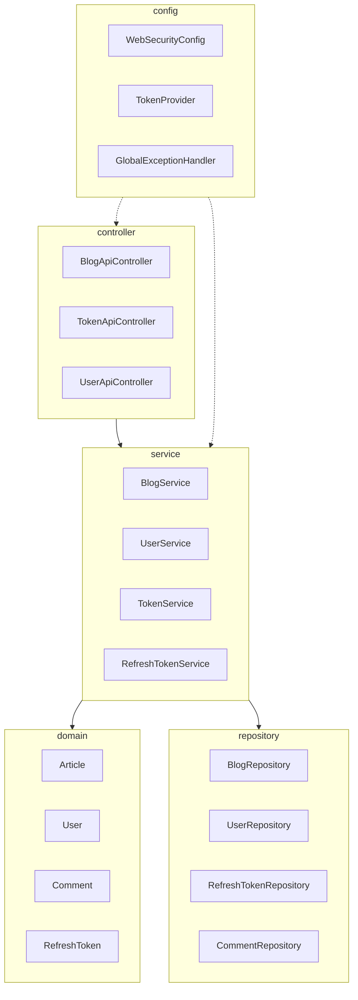
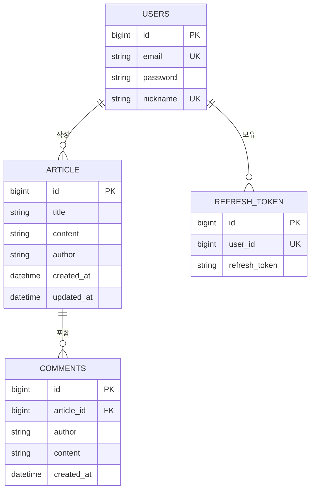

# 블로그 서비스 API (Blog Service)

## 프로젝트 개요

- 본 프로젝트는 사용자가 블로그 글을 작성, 조회, 수정, 삭제하고 댓글을 달 수 있는 RESTful API 서버입니다.
- OAuth2(Google) 및 JWT 기반의 인증 시스템을 갖추고 있습니다.

<br>

## 기술 스택

- **Backend**
  - Java 21
  - Spring Boot 4.0.4
- **Security & Auth**
  - Spring Security
  - OAuth2 Client (Google)
  - JWT (jjwt 0.12.3)
- **Database**
  - Spring Data JPA
  - H2 Database (In-memory)
- **Build Tool**
  - Gradle

<br>

## 시스템 아키텍처



### 모듈별 역할

- **controller**
  - 사용자의 HTTP 요청을 수신하고 비즈니스 로직으로 전달하며, 결과를 일관된 `ApiResponse` 형식으로 반환
- **service**
  - 핵심 비즈니스 로직을 수행하며, 리포지토리와 도메인 모델을 조율하여 유스케이스를 처리
- **domain**
  - 시스템의 핵심 데이터 객체(Entity)와 비즈니스 규칙을 정의하며 데이터베이스 테이블과 매핑됨
- **repository**
  - 데이터베이스의 영속성(CRUD) 처리를 담당하는 JPA 리포지토리 모듈
- **config**
  - JWT 보안 설정, OAuth2 로그인, 전역 예외 처리(`GlobalExceptionHandler`) 등 시스템 전반의 환경 설정을 관리

<br>

## ERD (Entity Relationship Diagram)



<br>

## 주요 기능

- **게시글 관리 (Blog API)**
  - 블로그 글 생성, 목록 조회, 단건 조회, 수정, 삭제 기능
- **댓글 시스템 (Comment API)**
  - 특정 게시글에 대한 댓글 작성 기능
- **인증 및 인가 (Auth & Token)**
  - OAuth2(Google)를 통한 소셜 로그인 지원
  - JWT(Access/Refresh Token) 기반의 세션리스 인증
  - 리프레시 토큰을 통한 액세스 토큰 재발급 기능
- **회원 관리**
  - 일반 회원가입 및 사용자 정보 연동

<br>

## 실행 방법

1. 프로젝트 클론 및 빌드
   ```bash
   ./gradlew build
   ```

2. 서버 실행
   ```bash
   ./gradlew bootRun
   ```

3. API 확인
   - 기본 포트: 8080
   - H2 Console: http://localhost:8080/h2-console

<br>

## API 문서

### 게시글 작성
- **Endpoint**
  - `/api/articles`
- **Method**
  - `POST`
- **Description**
  - 새로운 블로그 게시글을 작성함
- **Request Body**
  ```json
  {
    "title": "게시글 제목 (최대 10자)",
    "content": "게시글 상세 내용"
  }
  ```
- **Response Body**
  ```json
  {
    "status": "success",
    "data": {
      "id": 1,
      "title": "게시글 제목",
      "content": "게시글 상세 내용",
      "author": "user@email.com",
      "createdAt": "2026-03-24T17:00:00"
    }
  }
  ```

### 게시글 전체 조회
- **Endpoint**
  - `/api/articles`
- **Method**
  - `GET`
- **Description**
  - 등록된 모든 블로그 게시글 목록을 조회함
- **Response Body**
  ```json
  {
    "status": "success",
    "data": [
      {
        "id": 1,
        "title": "게시글 1",
        "content": "내용 1",
        "author": "user@email.com",
        "createdAt": "2026-03-24T17:00:00"
      }
    ]
  }
  ```

### 게시글 단건 조회
- **Endpoint**
  - `/api/articles/{id}`
- **Method**
  - `GET`
- **Description**
  - 특정 ID의 게시글 상세 정보를 조회함
- **Response Body**
  ```json
  {
    "status": "success",
    "data": {
      "id": 1,
      "title": "게시글 제목",
      "content": "게시글 상세 내용",
      "author": "user@email.com",
      "createdAt": "2026-03-24T17:00:00"
    }
  }
  ```

### 게시글 수정
- **Endpoint**
  - `/api/articles/{id}`
- **Method**
  - `PUT`
- **Description**
  - 특정 ID의 게시글 제목과 내용을 수정함
- **Request Body**
  ```json
  {
    "title": "수정할 제목",
    "content": "수정할 내용"
  }
  ```
- **Response Body**
  ```json
  {
    "status": "success",
    "data": {
      "id": 1,
      "title": "수정된 제목",
      "content": "수정된 내용"
    }
  }
  ```

### 게시글 삭제
- **Endpoint**
  - `/api/articles/{id}`
- **Method**
  - `DELETE`
- **Description**
  - 특정 ID의 게시글을 삭제함
- **Response Body**
  ```json
  {
    "status": "success",
    "data": null
  }
  ```

### 댓글 작성
- **Endpoint**
  - `/api/comments`
- **Method**
  - `POST`
- **Description**
  - 특정 게시글에 댓글을 작성함
- **Request Body**
  ```json
  {
    "articleId": 1,
    "content": "댓글 내용"
  }
  ```
- **Response Body**
  ```json
  {
    "status": "success",
    "data": {
      "id": 1,
      "content": "댓글 내용"
    }
  }
  ```

### 회원 가입
- **Endpoint**
  - `/api/signup`
- **Method**
  - `POST`
- **Description**
  - 일반 사용자 계정을 생성함
- **Request Body**
  ```json
  {
    "email": "user@email.com",
    "password": "password123"
  }
  ```
- **Response Body**
  ```json
  {
    "status": "success",
    "data": 1
  }
  ```

### 액세스 토큰 재발급
- **Endpoint**
  - `/api/token`
- **Method**
  - `POST`
- **Description**
  - 리프레시 토큰을 통해 새로운 액세스 토큰을 발급받음
- **Request Body**
  ```json
  {
    "refreshToken": "eyJhbG..."
  }
  ```
- **Response Body**
  ```json
  {
    "status": "success",
    "data": {
      "accessToken": "eyJhbG..."
    }
  }
  ```

### 리프레시 토큰 삭제
- **Endpoint**
  - `/api/refresh-token`
- **Method**
  - `DELETE`
- **Description**
  - 현재 사용자의 리프레시 토큰을 삭제함 (로그아웃 처리)
- **Response Body**
  ```json
  {
    "status": "success",
    "data": null
  }
  ```

<br>

## 상태 및 오류 코드

### 공통 응답 형식

- **Success Response**
  ```json
  {
    "status": "success",
    "data": {
     }
  }
  ```
- **Error Response**
  ```json
  {
    "status": "error",
    "message": "에러 상세 메시지",
    "code": "E1"
  }
  ```

### 주요 오류 코드 (Error Codes)

- **공통**
  - `E1` (INVALID_INPUT_VALUE)
    - **message**: `올바르지 않은 입력값입니다.`
    - **description**: 요청 파라미터가 비어 있거나 유효성 검증에 실패한 경우
  - `E2` (METHOD_NOT_ALLOWED)
    - **message**: `잘못된 HTTP 메서드를 호출했습니다.`
    - **description**: API 엔드포인트에 허용되지 않은 HTTP 메서드로 요청한 경우
  - `E3` (INTERNAL_SERVER_ERROR)
    - **message**: `서버 에러가 발생했습니다.`
    - **description**: 서버 내부 로직 처리 중 예상치 못한 예외가 발생한 경우
  - `E4` (NOT_FOUND)
    - **message**: `존재하지 않는 엔티티입니다.`
    - **description**: 요청한 리소스를 데이터베이스에서 찾을 수 없는 경우

- **게시글(Article)**
  - `A1` (ARTICLE_NOT_FOUND)
    - **message**: `존재하지 않는 아티클입니다.`
    - **description**: 요청한 ID에 해당하는 게시글이 존재하지 않는 경우

<br>

## 시스템 정책 및 제약 사항

- **데이터 검증 정책**
  - **게시글 제목**: 최소 1자에서 최대 10자로 제한됨 (`@Size(min = 1, max = 10)`)
  - **필수 값**: 제목(`title`)과 내용(`content`)은 반드시 입력되어야 함 (`@NotNull`)

- **인증 및 보안 정책**
  - **인증 방식**: JWT(JSON Web Token) 기반의 세션리스 인증 방식을 사용함
  - **인가 범위**: 게시글의 생성, 수정, 삭제 및 댓글 작성은 인증된 사용자만 가능함
  - **소셜 로그인**: OAuth2를 통한 Google 로그인을 지원하며, 최초 로그인 시 자동 회원가입 처리됨

- **토큰 관리 정책**
  - **액세스 토큰**: 모든 요청 헤더의 `Authorization: Bearer <token>`을 통해 검증됨
  - **리프레시 토큰**: 액세스 토큰 만료 시 `/api/token`을 통해 새로운 토큰을 발급받기 위해 사용되며, 쿠키 또는 별도 저장소에 관리됨
